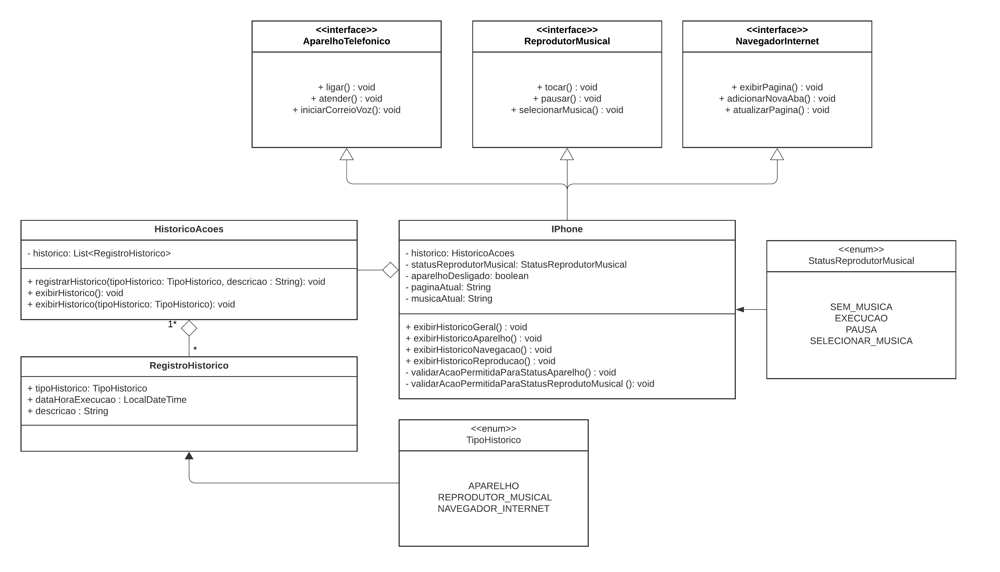
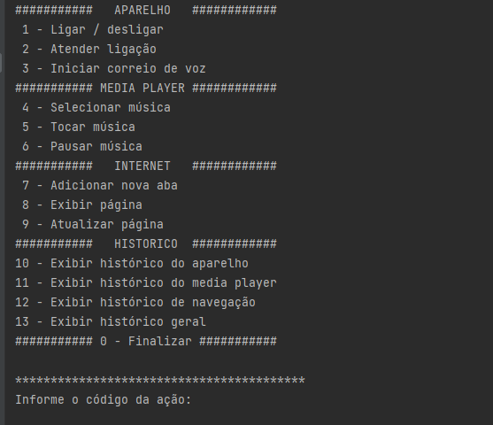
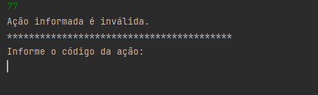
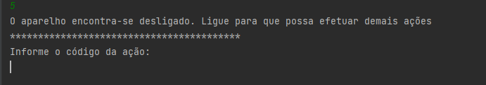
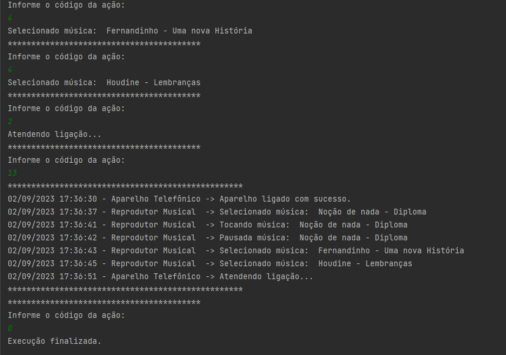

# Desafio DIO sobre modelagem do IPhone

## Aplicação
 * Desolvimento aplicação em Java na versão 17.  
 * Ao executar o programa será exibido o menu de opções e pedido para que uma seja informada.  

 * Caso seja informado uma valor que não seja um número:    

 * Caso seja informado uma valor inválido:  

 * Algumas ações requerem que o aparelho esteja ligado:  

 * Exemplo de uma saída após algumas operações:  
